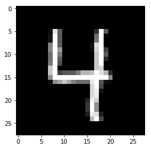
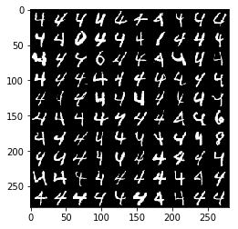

# AutoEncoders
[](https://opensource.org/licenses/Apache-2.0)
### 1. Getting Started
#### -  a) Loading Data 

```python
    import numpy as np
    import ImShow as I
    import matplotlib.pyplot as plt
    from collections import Counter
    
    data = np.load("data.npk")
    y = np.load("y.npk")
    print ("Data Shape",data.shape)

  ```
   Data Shape (5124, 784)
   ```python
    #To print how many images for each digit
    print (Counter(y.reshape(y.size)))
   ```
   Counter({4.0: 4859, 0.0: 35, 9.0: 34, 7.0: 34, 2.0: 29, 6.0: 28, 5.0: 28, 8.0: 27, 1.0: 25, 3.0: 25})
 ```python
    #Show the image of one digit
    one_pic = data[0].reshape(28,28)
    plt.imshow(one_pic,cmap='gray')
    plt.show()
    Xpic = I.tile_raster_images(X = data, img_shape=(28,28), tile_shape=(10,10))
    plt.imshow(Xpic,cmap='gray')
    plt.show()

```


#### -  b) Sample code to run create,train and run an AE
```python
    from DeepAE import *
    import time
    import os

    os.chdir("../../")
    x = np.load(r"./data/data.npk")#Load simple MINST Data
    start_time = time.time()
    with tf.Session() as sess:
        ae = Deep_Autoencoder(sess=sess, input_dim_list=[784, 225, 100])
        error = ae.fit(x, sess=sess, learning_rate=0.01, batch_size=500, iteration=500, verbose=True)
        R = ae.getRecon(x, sess=sess)
        print("size 100 Runing time:" + str(time.time() - start_time) + " s")
        error = ae.fit(R, sess=sess, learning_rate=0.01, batch_size=500, iteration=500, verbose=True)
```
